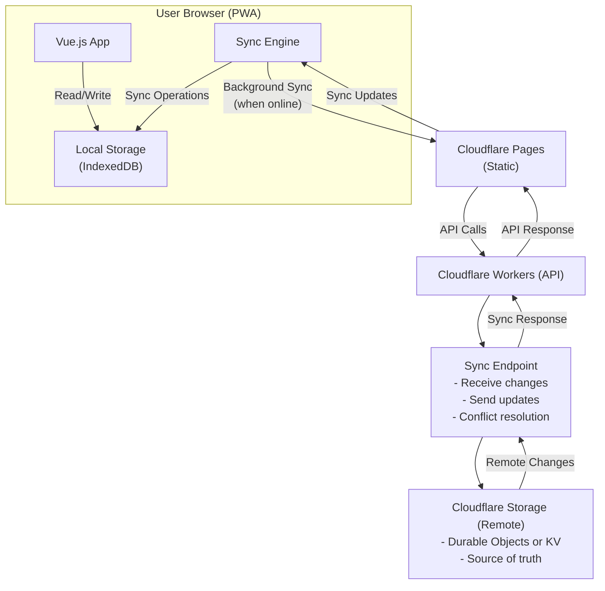

# Architecture

## Overview

jm-tasks is a Progressive Web Application (PWA) built with Vue.js, designed to provide a seamless task management
experience across devices with offline capabilities. The application follows a **local-first data architecture**,
where data is stored locally first and synchronized with a remote server in the background.

## High-Level Architecture

## Technology Stack

### Frontend

- **Framework**: Vue.js
- **Type**: Single Page Application (SPA) with PWA capabilities
- **Build Tool**: Vite
- **State Management**: To be determined based on complexity
- **Routing**: Vue Router
- **PWA Features**: Service Worker, Web App Manifest

### Local Storage

- **Primary Storage**: IndexedDB (browser)
- **Purpose**: Local-first data persistence
- **Benefits**: Fast reads/writes, offline-first, no network latency
- **Data**: All task data stored locally

### Sync Engine

- **Purpose**: Bidirectional synchronization between local and remote storage
- **Implementation**: **Cloudflare Workers + Durable Objects**
  - Workers provide sync endpoints and conflict resolution
  - Durable Objects act as the authoritative remote store
  - Features:
    - Change tracking via local sync queue
    - Background synchronization (polling + online events)
    - Conflict resolution (last-write-wins for Phase 1)
    - Delta sync (only sends changes, not full datasets)
    - Optimistic updates via local-first writes
    - Offline queue management
    - Multi-device synchronization
    - Real-time updates when online (future)
  - **Alternative Options** (if needed):
    - Cloudflare KV (eventually consistent, simpler)

### Backend & Infrastructure

- **Hosting**: Cloudflare Pages (static assets)
- **API**: Cloudflare Workers (sync endpoints, if custom backend needed)
- **Remote Data Storage**:
  - **Primary**: Cloudflare Durable Objects
  - **Alternative**: Cloudflare KV (if consistency requirements are lower)
  - Durable Objects provide strong consistency for sync operations
  - Acts as source of truth for multi-device synchronization
- **Domain**: tasks.joemaffei.dev
- **CDN**: Cloudflare global network

## Application Structure

### Planned Component Architecture

- **Views/Pages**: Main application views (task list, task detail, settings)
- **Components**: Reusable UI components
- **Services**: Business logic and data access
- **Sync Engine**: Handles local-remote synchronization
- **Local Storage Layer**: IndexedDB wrapper/abstraction
- **Store**: Application state management (reactive to local storage)
- **Utils**: Helper functions and utilities
- **Assets**: Static resources (images, icons, etc.)

## Data Flow

### Local-First Flow (Primary Path)

1. User interacts with Vue components
2. Components call services to read/write data
3. Services read/write directly to local IndexedDB
4. UI updates immediately (optimistic updates)
5. Sync engine queues changes for background sync
6. When online, sync engine pushes changes to Cloudflare Workers
7. Sync engine pulls remote changes and merges with local data
8. UI reactively updates if conflicts resolved or new data arrives

### Sync Flow

1. Sync engine monitors local changes (change tracking)
2. When online, sync engine batches local changes
3. Sends changes to Cloudflare Workers sync endpoint
4. Server processes changes and resolves conflicts
5. Server sends back any remote changes
6. Sync engine merges remote changes into local storage
7. Conflict resolution strategy applied (last-write-wins, manual, or custom)
8. Local storage updated, UI reactively reflects changes

### Offline Flow

1. All operations work against local IndexedDB
2. Changes are queued in sync engine
3. Service worker may cache sync requests
4. When connection restored, sync engine processes queue
5. Normal sync flow resumes

## PWA Features

### Service Worker

- Caching strategy for static assets
- Background sync API integration with sync engine
- Offline queue management
- Push notifications (future feature)

### Local-First Benefits

- **Instant UI Updates**: No network latency for reads/writes
- **Offline-First**: Full functionality without internet connection
- **Multi-Device Sync**: Changes sync across devices when online
- **Conflict Resolution**: Handles concurrent edits gracefully
- **Reduced Server Load**: Sync only changes, not full data sets

## Sync Data Model

### Task Metadata

- Each task has a stable `syncId` generated on creation
- Each device stores a persistent `deviceId`
- Sync metadata fields:
  - `deletedAt` for soft deletes
  - `lastSyncedAt` for sync bookkeeping
- Local deletes are soft deletes to ensure the sync engine can propagate them

### Sync Queue

- Local writes enqueue changes into a sync queue
- The queue is flushed on successful sync
- Queue entries are keyed by `taskSyncId` to collapse multiple changes into the latest state

### Sync Endpoints

- `POST /sync/push` receives batched local changes
- `GET /sync/pull?since=ISO_TIMESTAMP` returns remote changes since last sync

### Web App Manifest

- App metadata
- Icons for various device sizes
- Display mode configuration
- Theme colors

## Security Considerations

- HTTPS enforced via Cloudflare
- Authentication tokens stored securely
- API endpoints protected
- CORS configuration for API access
- Content Security Policy headers

## Scalability Path

### Phase 1 (Current)

- Single user (Joe Maffei)
- Minimal authentication
- Local-first architecture with IndexedDB
- Background sync to Cloudflare storage
- Last-write-wins conflict resolution

### Phase 2 (Future)

- Multi-user support
- OAuth providers (Google, Apple)
- Enhanced database solution if needed
- User management and permissions

## Deployment Strategy

- Continuous deployment via Cloudflare Pages
- Git-based workflow
- Environment-specific configurations
- Automated builds and deployments

## Conflict Resolution

### Strategy

- **Last-Write-Wins (LWW)**: Simple, suitable for single-user initially
- **Operational Transformation (OT)**: For future multi-user scenarios
- **Custom Merge Logic**: For complex conflicts (e.g., task dependencies)
- **Manual Resolution**: User intervention for critical conflicts

### Implementation

- Each change tracked with timestamp and device ID
- Server maintains change log for conflict detection
- Sync engine compares local and remote versions
- Resolution applied before merging into local storage

## Performance Considerations

- **Local-First Benefits**: Instant reads/writes from IndexedDB
- **Efficient Sync**: Only sync deltas/changes, not full datasets
- **Code splitting** for optimal load times
- **Lazy loading** of routes
- **Optimized bundle sizes**
- **Cloudflare CDN** for static assets and API responses
- **Background sync** doesn't block UI operations
