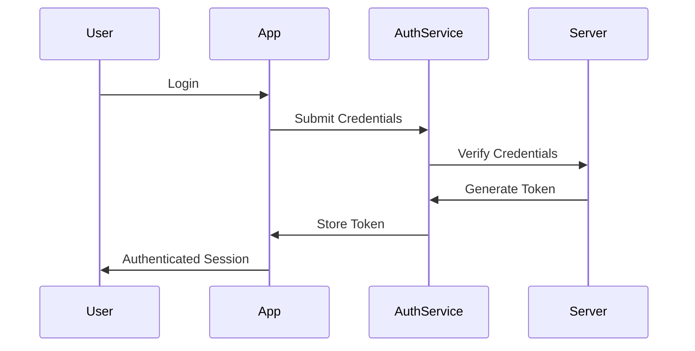
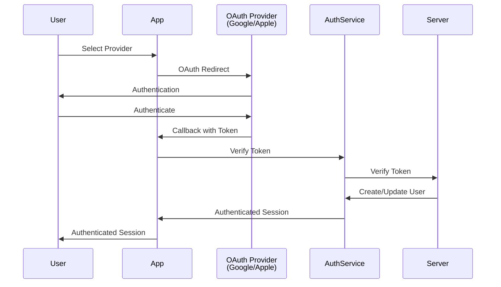

# Authentication

## Current Strategy (Phase 1)

### Single-User Setup

The initial implementation uses a minimal authentication approach designed for a single user (Joe Maffei). This
simplifies the development process while maintaining security for personal use.

### Implementation Approach

- Simple authentication mechanism
- Session-based or token-based authentication
- Minimal user management overhead
- Secure storage of credentials/tokens

### Security Considerations

- All communication over HTTPS
- Secure token storage (httpOnly cookies or secure localStorage)
- Protection against common vulnerabilities (XSS, CSRF)
- Input validation and sanitization

## Future Strategy (Phase 2)

### Multi-User Support

As the application scales to support multiple users, the authentication system will be enhanced with:

### OAuth Providers

- **Google Sign-In**: Integration with Google OAuth 2.0
- **Apple Sign-In**: Integration with Apple's Sign in with Apple
- Additional providers as needed

### Enhanced Features

- User registration and profile management
- Role-based access control (if needed)
- Session management across devices
- Password reset functionality (if email-based auth is added)
- Two-factor authentication (optional)

## Authentication Flow

### Current Flow (Phase 1)

### Future Flow (Phase 2)

## Token Management

### Storage

- Secure storage mechanism (httpOnly cookies preferred for web)
- Token refresh strategy
- Expiration handling
- Logout and token invalidation

### Validation

- Token verification on API requests
- Expiration checks
- Refresh token rotation (if implemented)

## API Security

### Protected Endpoints

- All task-related endpoints require authentication
- User-specific data isolation
- Authorization checks on data access

### Request Headers

- Authorization header with bearer token
- CSRF token for state-changing operations
- Content-Type validation

## User Data Privacy

- User data is isolated per user
- No cross-user data access
- Secure data transmission
- Compliance with privacy best practices

## Migration Path

When transitioning from Phase 1 to Phase 2:

- Maintain backward compatibility during transition
- User data migration strategy
- Seamless upgrade path for existing user
- Testing strategy for authentication changes

## Implementation Notes

- Authentication logic should be centralized in a service module
- Use composables for authentication state management
- Clear separation between authentication and authorization
- Comprehensive error handling for auth failures
- User-friendly error messages
